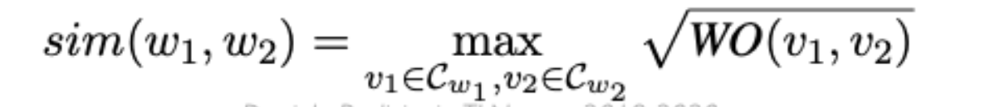
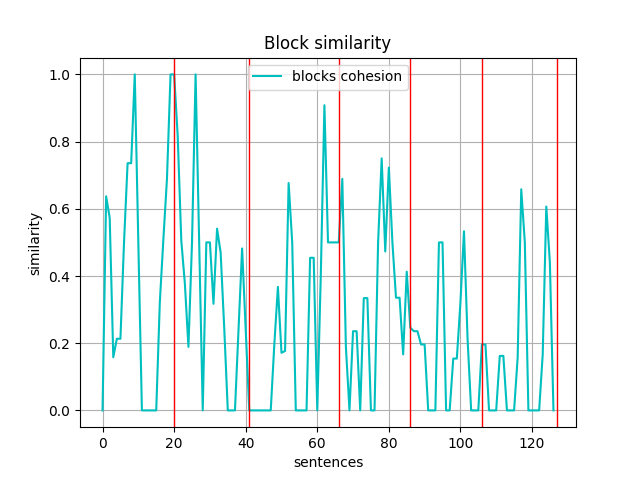

# Relazione Esercizio 4

In questa esercitazione, abbiamo scritto ispirandoci al Text Tiling un algoritmo di Document Segmentation. I passi iniziali di tale algoritmo sono molto semplici, poiché abbiamo voluto rimanere il più possibile fedeli all'implementazione del Text Tilling di NLTK. L'algoritmo si comporta nel seguente modo:

1. Importato e inizializzato nasari all'interno di un dizionario. In una stuttura di configurazione è possibile impostare gli n primi elementi da salvare in dizionario per ogni word.

2. Tramite NLTK abbiamo mappato il corpus in una lista di sentences e generato due strutture. una con le sentences come lista di stringhe e una con le sentences come lista di lista di tokens.

3. Per ogni token (parola) in ogni frase è stata calcolata la similarietà tra quest'ultimo e tutti gli altri token prima nella frase precedente e poi in quella successiva. Per calcolare tale similarietà si è ricorsi prima all'uso della metrica  del Weighted Overlap per computare la similarietà tra i due vettori Nasari dei due token,


poi successivamente, si è fatto ricorso allo Square Root Weighhted Overlap per calcolare la similarietà finale delle due parole a partire dal Weighted Overlap calcolato in precedenza. Infine, la similarietà di ogni riga sarà equivalente alla somma della similarietà della riga corrente e della precedente con la similarietà della riga corrente con la successiva.



4. Essendo che recedentemente abbiamo ottenuto un vettore di similarità assegnando uno score ad ogni frase. Per cui è stato usato K-Means per clusterizzare gli scores e individuare il numero minimo di cluster che definiranno le finistre iniziali per la segmentazione. Il miglior valore di cluster è stato calcolato automaticamente con la Silouhette Analysis

> **[Silhouette analysis](https://www.jeremyjordan.me/grouping-data-points-with-k-means-clustering/)**:
>
> Another more automated approach would be to build a collection of k-means clustering models with a range of values for k and then evaluate each model to determine the optimal number of clusters.
>
> We can use Silhouette analysis to evaluate each model. A Silhouette coefficient is calculated for observation, which is then averaged to determine the Silhouette score. **The coefficient combines the average within-cluster distance with average nearest-cluster distance to assign a value between -1 and 1**. A value below zero denotes that the observation is probably in the wrong cluster and a value closer to 1 denotes that the observation is a great fit for the cluster and clearly separated from other clusters. This coefficient essentially measures how close an observation is to neighboring clusters, where it is desirable to be the maximum distance possible from neighboring clusters.
>
> We can automatically determine the best number of clusters, k, by selecting the model which yields the highest Silhouette score.

```python
print("\tComputing clusters using K-Means...")
sentences_similarities = np.array(similarities)
data = sentences_similarities.reshape(-1, 1)  # needed for cluster computin

# Sets the best cluster size within the minimum and maximum supplied. Eg.: 2,10
clusters_size_ranges = np.arange(2, 10)
clusters_sizes = {}
for size in clusters_size_ranges:
    model = KMeans(n_clusters=size).fit(data)
    predictions = model.predict(data)
    clusters_sizes[size] = silhouette_score(data, predictions)
best_clusters_size = max(clusters_sizes, key=clusters_sizes.get)
print("\t\tThe best cluster group size is: {}".format(best_clusters_size))
```

**Note**: è stato dato il range iniziale (2, 10) in cui generare modelli per valutre cluster. Sviluppi futuri potrebbero prevedere l'idea di ricalcolare con un range più alto laddove la _clusters size_ ottimale sia maggiore di un paramentro (Es. 70% del range).

5. A questo punto il numero minimo ottimale di clusters è noto. In un primo momento abbiamo provato a rieseguire Kmeans per verificare la distribuzione dei cluster sul corpus. Non riuscendo a trovare un algoritmo efficiente per i casi in cui i cluster si ripetono più volte abbiamo optato per il semplice shift delle finestre rispetto alla similarità delle frasi.

6. Il corpus viene suddiviso in un numero di breakpoints uguale al numero di clusters calcolati. per ognuno di queti break point si verifica la similarità delle frasi di frontiera con le finestre adiacenti ed eventualmente si sposta il break point.

7. L'algorimo termina quando non ci sono più breakpoints da spostare

## Risultati
A fine esecuzione, l'algoritmo descritto, ha dato in output il seguente plot:



come si può notare, K-Means a fine iterazioni è stato in grado basandosi sulal simiarietà dellew frasi di posizionare in modo _"aprossimativamente corretto"_
i giusti breakpoint.
